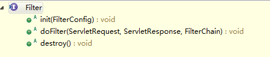

在某种程度上来讲，可以将servlet看作是含有HTML的Java程序；将JSP看作是含有Java代码的HTML页面。JSP文档可以理解成是编写servlet的另一种形式，JSP页面会被翻译成servelt，而servlet会被编译。在整个请求期间运行的就是servlet。

## 1. Servlet的生命周期
服务器只对每一个servlet创建单一实例，每个用户请求会创建新的线程，将用户请求交付给相应的doGet和doPost进行处理。
首次创建servlet，会调用个init方法，因此，init应放置一次性设置代码的相关环节。

## 2. 状态代码
Web服务器对请求的响应，一般有一个状态行、一些响应报头、一个空行和相应的文档构成；Http响应的状态行由HTTP版本、一个状态代码和一段相关的消息组成。但是消息直接与状态代码相关，而http的版本是由服务器来决定的，故而，servlet需要做的只是设置状态代码。系统自动设置的代码为200。如果需要设置状态代码，则可以使用response.setStatus,response.sendRedirect或response.sendError方法。

### 设置状态代码：setStatus
> 在向客户程序发送任何文档内容之前设置状态代码

setStatus方法以一个整数（状态代码，int类型）为参数，但为了避免出错，尽量不要使用数字，而要使用HttpServletResponse中定义的常量。每个常量的名字都来自于每个常量所对应的标准HTTP1.1消息，全部大写并添加SC（Status Code）前缀，状态代码404对应的消息为Not Found，与之对应的常量是SC_NOT_FOUND。

Http1.1中可用的特定的状态代码，如下

|代码区间|描述|
|---|---|
|100-199|都是信息性的，标示客户应该采取的其他动作|
|200-299|标示请求成功|
|300-399|用于已移走的文件，常常包括Location报头，指出新的地址|
|400-499|表明由客户引发的错误|
|500-599|表示由服务器引发的错误|

## Http相应报头

指定报头，最常用的方式是使用HttpServletResponse的setHeader方法，这个方法接收两个字符串：报头的名称和报头的值。和设置状态代码一样，必须在返回实际的文档之前指定相关报头。

```java
 setHeader（String headerName,String headerValue） 
```
Http允许相同的报头名多次出现，例如，多个Accept和Set-Cookie报头分别指定所支持的不同MIME类型和不同cookie。

## 3. 过滤器
Servlet过滤器可以动态的拦截请求和响应，可以实现以下目的：

* 在客户端请求访问后端资源之前，拦截请求
* 在服务端的响应发送客户端之前，处理响应

### 3.1 过滤器方法
过滤器是实现`javax.servlet.Filter`接口的类。
